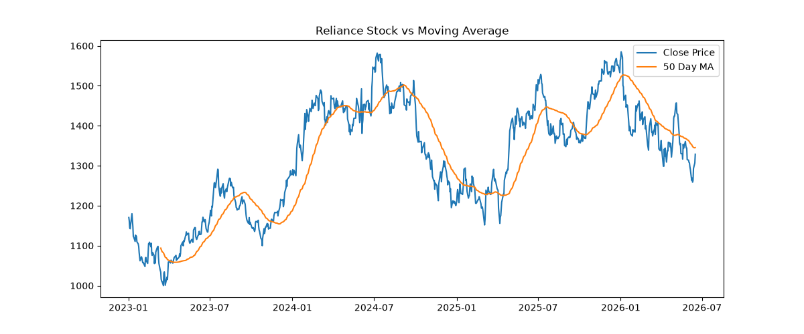

# 📈 Stock Market Intelligence Dashboard

## Overview

This project is a financial analytics dashboard built using Python and Yahoo Finance. It analyzes stock performance, volatility, portfolio returns, moving averages, and benchmark comparison against the NIFTY 50 index using real-world market data.

## Objectives

- Analyze historical stock performance.
- Compare multiple stocks across different sectors.
- Measure risk using volatility analysis.
- Simulate portfolio performance.
- Benchmark stocks against NIFTY 50.
- Generate actionable investment insights.

## Stocks Analyzed

- Reliance Industries (RELIANCE.NS)
- Tata Consultancy Services (TCS.NS)
- Infosys (INFY.NS)
- HDFC Bank (HDFCBANK.NS)

## Features

### 1. Single Stock Analysis
- Historical price analysis
- Trend visualization
- Performance tracking

### 2. Multi-Stock Comparison
- Compare multiple stocks simultaneously
- Identify outperformers and underperformers

### 3. Daily Return Analysis
- Percentage return calculation
- Return trend analysis

### 4. Volatility Analysis
- Risk measurement using standard deviation
- Identification of high-risk and low-risk stocks

### 5. Moving Average Analysis
- 50-Day Moving Average
- Trend identification

### 6. Portfolio Simulation
- Equal investment allocation
- Portfolio value estimation

### 7. NIFTY 50 Benchmark Analysis
- Stock performance vs market benchmark
- Relative performance comparison

## Technologies Used

- Python
- Pandas
- NumPy
- Matplotlib
- Yahoo Finance API (yFinance)
- Jupyter Notebook
- GitHub
  
## Project Structure

- stock_analysis.ipynb
- requirements.txt
- LICENSE
- README.md
- reliance_stock_analysis.png

## Key Findings

### Volatility Ranking

| Stock | Risk Level |
|---------|-----------|
| Infosys | Highest |
| TCS | High |
| Reliance | Medium |
| HDFC Bank | Lowest |

### Performance Insights

- Reliance generated the highest return among selected stocks.
- HDFC Bank was the most stable stock.
- Infosys showed the highest volatility.
- Diversified portfolios help reduce investment risk.
  
## Business Questions Solved

- Which stock performed best?
- Which stock generated the highest return?
- Which stock carried the highest risk?
- Which stock was most stable?
- How does diversification impact portfolio performance?
- How does a stock perform compared to NIFTY 50?

## Project Outcomes

- Identified the best-performing stock.
- Measured investment risk using volatility.
- Simulated portfolio growth.
- Compared stock returns against market benchmarks.
- Generated actionable financial insights.

### Reliance Stock Analysis

## Future Enhancements

- Interactive Streamlit Dashboard
- Real-Time Stock Data
- Portfolio Optimization
- Sharpe Ratio Analysis
- News Sentiment Analysis
- Buy/Sell Signal Generation
- Interactive Plotly Charts

## Author

Aditya Kr Sharma

B.Tech CSE (Data Science)

GitHub: ADY785690
